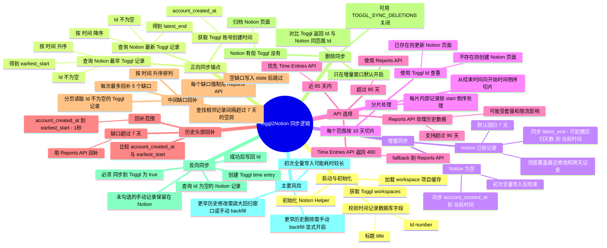

# Toggl2Notion 同步逻辑说明

本文档记录当前 Toggl2Notion 的数据同步顺序、API 选择策略、去重方式、反向同步逻辑，以及现有风险点。内容基于当前脚本实现整理，便于后续优化同步策略。

## 总体策略

当前同步采用“最新优先，缺口补偿”的策略：

1. 优先同步 Notion 中最新 Toggl 记录之后的数据，保证最近数据及时更新。
2. 如果 Notion 为空，则从 Toggl 账号创建时间开始做初次全量导入。
3. 如果发现账号创建时间到 Notion 最早记录之间存在较大缺口，则通过 Reports API 回补历史头部缺口。
4. 再扫描 Notion 中间时间段，发现相邻记录之间超过阈值的缺口后，用 Reports API 回补。
5. 增量窗口内会对比 Toggl 与 Notion 的 `Id`，归档已从 Toggl 删除的 Notion 页面。
6. 最后执行 Notion 到 Toggl 的反向同步，只处理明确勾选的手动记录。

## Mermaid 思维导图

## 详细流程

### 1. 初始化

同步开始后会先初始化 Notion 与 Toggl 相关配置，并校验 Notion「时间记录」数据库的关键字段：

- `Id`：number 类型，用作 Toggl 时间记录的去重主键。
- `标题`：title 类型，用作 Notion 页面标题。

随后获取 Toggl workspaces，并加载每个 workspace 的项目缓存，用于后续补充项目、客户、标签等关联信息。

### 2. 查询同步锚点

脚本会从 Notion「时间记录」数据库查询两个时间锚点：

- `latest_end`：只查询 `Id` 不为空的 Toggl 同步记录，按 `时间` 降序查询 1 条，得到最新记录的结束时间；如果没有结束时间，则使用开始时间。
- `earliest_start`：只查询 `Id` 不为空的 Toggl 同步记录，按 `时间` 升序查询 1 条，得到最早记录的开始时间。

手动创建、`Id` 为空且未同步到 Toggl 的 Notion 记录不会参与正向同步锚点判断。

同时通过 Toggl API 获取账号创建时间 `account_created_at`，用于判断是否存在历史头部缺口。

### 3. 增量同步

如果 Notion 已有记录：

- 同步范围为 `latest_end - TOGGL_INCREMENTAL_LOOKBACK_DAYS` 到 `当前时间`。
- 默认回扫 7 天，可通过环境变量 `TOGGL_INCREMENTAL_LOOKBACK_DAYS` 调整，最大限制为 90 天。
- 往前多取一段时间是为了覆盖最近记录被修改、跨天记录、API 延迟等情况。

如果 Notion 没有任何记录：

- 默认同步范围为 `account_created_at` 到 `当前时间`。
- 该逻辑相当于初次全量导入。
- 如果设置 `TOGGL_INITIAL_IMPORT_DAYS`，则初次导入只从最近 N 天开始，避免多年历史一次性导入过重。
- 初次全量导入完成后会直接结束，不再执行额外历史缺口扫描。

### 4. 时间范围切片与处理顺序

任意同步范围进入 `sync_data_range` 后，会按 10 天为一个分片处理。

处理顺序是从新到旧：

1. 先处理靠近 `end_date` 的 10 天。
2. 再把 `current_end` 向前移动到上一个分片。
3. 一直处理到 `start_date`。

每个分片拉到 entries 后，也会按 `start` 时间倒序处理。因此整体写入 Notion 的顺序是“最新记录优先”。

示例：同步 `2026-01-01 ~ 2026-07-03` 时，大致顺序为：

1. `2026-06-23 ~ 2026-07-03`
2. `2026-06-13 ~ 2026-06-23`
3. `2026-06-03 ~ 2026-06-13`
4. 继续向前，直到 `2026-01-01`

### 5. API 选择策略

同步每个分片时，会根据时间远近选择 API：

- 如果分片结束时间距离当前时间不超过约 85 天，优先使用 Track API v9 的 Time Entries API。
- 如果分片结束时间距离当前时间超过约 85 天，直接使用 Reports API。
- 如果 Time Entries API 返回 `400`，认为可能触发 90 天历史限制，会自动 fallback 到 Reports API。
- 如果 Time Entries API 单个 10 天分片返回数量达到保护阈值 `1000`，会认为可能接近接口上限，并 fallback 到 Reports API 重新拉取，避免漏数据。
- Reports API 明确使用 `page_size=100`，并按 `page` 循环读取，日志会打印每页条数、`per_page` 和 `total_count`。
- 如果返回 `402`、`403`、`429` 或其他非成功状态，会记录失败并停止当前范围继续同步。

当前验证结果表明：

- Time Entries API 对历史数据存在约 90 天限制。
- Reports API 可以获取超过 90 天的数据，但可能受 Toggl 套餐、权限和限流影响。

### 6. 写入和去重

每条 Toggl 时间记录都要求有稳定的 `id`。写入 Notion 前会用这个 `id` 查询是否已有对应页面：

- 如果已有页面：更新该 Notion 页面。
- 如果没有页面：创建新的 Notion 页面。

因此当前核心去重主键是 Toggl 的 `Id`，不是标题、项目或时间范围。

### 7. 历史头部缺口回补

增量同步完成后，如果 Notion 已有最早记录，则比较：

- Toggl 账号创建时间 `account_created_at`
- Notion 最早记录 `earliest_start`

如果两者之间的间隔超过阈值，目前为 7 天，则认为账号创建时间到 Notion 最早记录之间存在历史缺口，并强制使用 Reports API 回补：

- 回补范围：`account_created_at` 到 `earliest_start - 1秒`
- 回补方向：范围内部仍然从新到旧分片处理

### 8. 中间缺口回补

脚本还会分页读取 Notion「时间记录」中 `Id` 不为空的 Toggl 同步记录，并按 `时间` 升序排列。随后检查相邻记录之间是否存在超过阈值的空洞：

- 阈值：超过 7 天。
- 每次运行最多自动处理 5 个中间缺口。
- 每个缺口都使用 Reports API 回补。
- 如果 Reports API 确认某个缺口没有任何记录，会写入本地 `state/` 状态文件；后续运行会跳过这个已确认的空缺口。

该机制用于修复历史导入中断、接口失败、早期脚本漏同步等造成的中间数据缺失。

### 9. Toggl 删除同步

增量同步成功拉取某个分片后，会在同一时间范围内查询 Notion「时间记录」中 `Id` 不为空的页面，并和本次 Toggl API 返回的 `Id` 集合对比。

如果 Notion 中存在某个 Toggl `Id`，但 Toggl API 在同一确认范围内没有返回该记录，则认为该记录已经从 Toggl 删除，脚本会归档对应 Notion 页面。

安全规则：

- 默认只在日常增量窗口执行删除同步。
- 只处理 `Id` 不为空的 Toggl 同步记录，手动 Notion 记录不会被归档。
- Notion 页面使用 archive，不做永久删除。
- 可以通过 `TOGGL_SYNC_DELETIONS=false` 关闭日常删除同步。
- 手动 backfill 默认不做删除同步；如果明确需要，可设置 `TOGGL_BACKFILL_SYNC_DELETIONS=true`。

### 9. Notion 到 Toggl 反向同步

正向同步完成后，会执行反向同步。当前安全规则是：

- 只查询 `Id` 为空的 Notion 时间记录。
- 必须同时满足 `同步到 Toggl = true`。
- 未勾选 `同步到 Toggl` 的手动记录只保留在 Notion，不会创建到 Toggl。
- 创建 Toggl 时间记录成功后，会把 Toggl 返回的 `id` 写回 Notion 的 `Id` 字段，避免重复创建。

## 手动 backfill 参数

可以通过环境变量指定一次性历史回补区间：

- `TOGGL_BACKFILL_START`：开始时间，例如 `2026-01-01`。
- `TOGGL_BACKFILL_END`：结束时间，例如 `2026-02-01`。

两个变量必须同时设置。设置后本次运行只执行该区间的 Reports API 回补，不再执行日常增量同步和自动缺口扫描。

## 当前已知问题

### 1. 手动 Notion 记录影响同步锚点的问题已修复

当前 `latest_end`、`earliest_start` 和中间缺口扫描只统计 `Id` 不为空的 Toggl 同步记录。

手动创建的 Notion 时间记录如果还没有写回 Toggl `Id`，不会影响正向同步边界，也不会参与中间缺口计算。

### 2. 真实无记录空档会被持久化跳过

中间缺口检测仍会先根据相邻记录间隔识别空洞；如果 Reports API 返回该区间没有任何记录，脚本会把这个空缺口写入本地 `state/` 状态文件。

后续运行会先跳过已确认的空缺口，再取本次最多 5 个待检查缺口，避免真实无记录的时间段长期占用回补额度。

### 3. 增量窗口已改为可配置回扫

当前增量同步范围是 `latest_end - TOGGL_INCREMENTAL_LOOKBACK_DAYS` 到当前时间，默认 7 天。

如果需要更积极地捕获历史修改，可以把 `TOGGL_INCREMENTAL_LOOKBACK_DAYS` 调大；如果担心 API 压力，可以调小，但最低为 1 天。

### 4. 删除同步已支持增量窗口内归档

如果 Toggl 中删除了一条落在当前增量回扫窗口内的时间记录，同步时会归档 Notion 中对应的 `Id` 页面。

更早历史记录的删除不会在日常同步中主动扫描；如需处理历史删除，可以先手动 backfill，并明确设置 `TOGGL_BACKFILL_SYNC_DELETIONS=true`。

### 5. 初次全量导入可能较重

如果 Notion 为空，当前会从 Toggl 账号创建时间同步到当前时间。对于使用多年的账号，这可能产生大量 Reports API 请求和 Notion 写入。

风险：

- 初次同步耗时较长。
- 更容易触发 Toggl 或 Notion 限流。
- 如果中途失败，下次可能需要重新扫描较大范围。

建议后续把初次导入拆成：

1. 默认导入最近 90 天或最近 1 年。
2. 更早历史通过明确的 backfill 参数分批导入。

## 建议优化顺序

1. 已完成：正向同步锚点和缺口扫描只统计 `Id` 不为空的 Toggl 记录。
2. 已完成：给中间缺口回补增加已检查状态，避免反复检查真实空档。
3. 已完成：增加可配置的回扫窗口，默认最近 7 天。
4. 已完成：增加手动 backfill 参数，用于明确指定历史同步区间。
5. 已完成：增量窗口内归档 Toggl 已删除记录；更早历史删除通过手动 backfill 显式开启。

## 关键配置和阈值

| 项目 | 当前值 | 说明 |
| --- | --- | --- |
| 增量同步回退 | 默认 7 天 | 从 `latest_end - TOGGL_INCREMENTAL_LOOKBACK_DAYS` 开始同步 |
| 分片大小 | 10 天 | 每个同步范围按 10 天切分 |
| Reports API page_size | 100 | 每个 10 天分片内继续分页拉取全部结果 |
| Time Entries API 安全窗口 | 约 85 天 | 超过后直接使用 Reports API |
| Time Entries API 条数保护 | 1000 | 达到阈值时 fallback 到 Reports API 防止漏数据 |
| 中间缺口阈值 | 7 天 | 相邻记录间隔超过该值会被认为是缺口 |
| 每次最多中间缺口 | 5 个 | 限制 Reports API 压力 |
| 去重主键 | Toggl `Id` | Notion 时间记录中的 number 字段 |
| 反向同步开关 | `同步到 Toggl` | checkbox，只有 true 才创建到 Toggl |
| 删除同步开关 | 默认开启 | `TOGGL_SYNC_DELETIONS=false` 可关闭增量窗口删除归档 |
